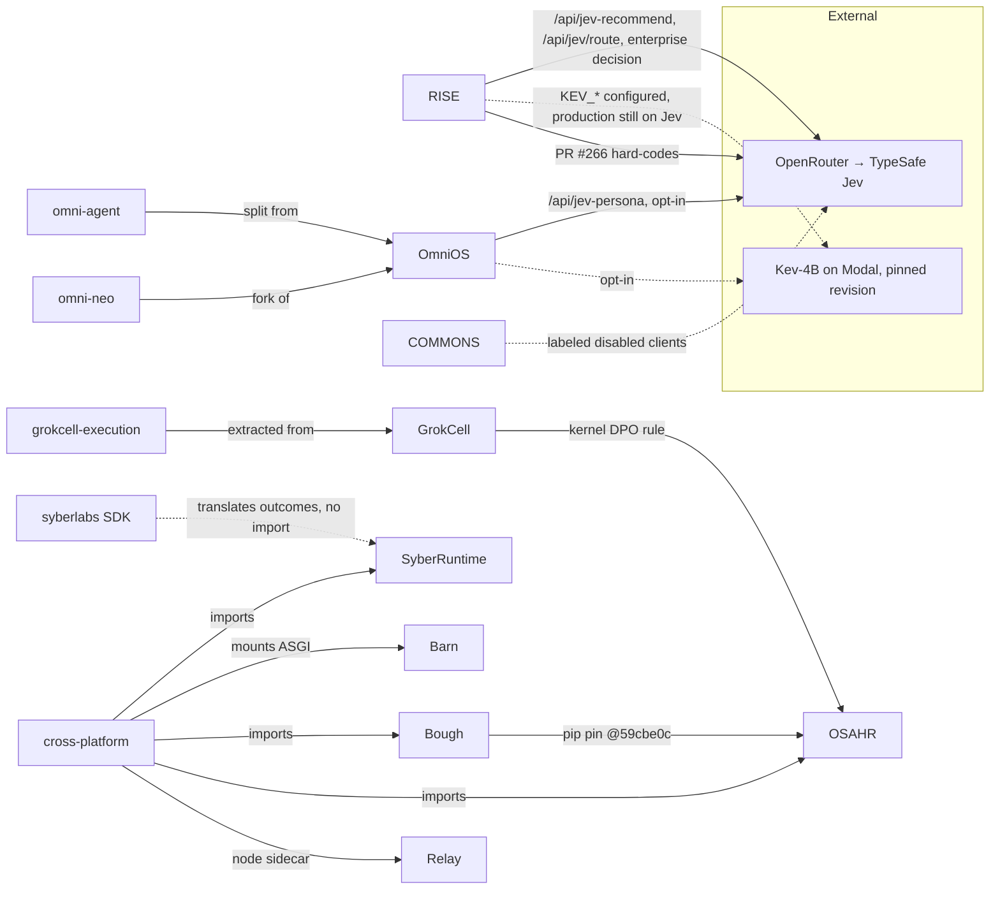
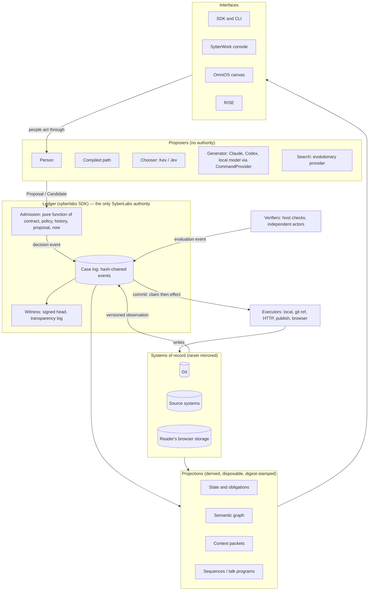
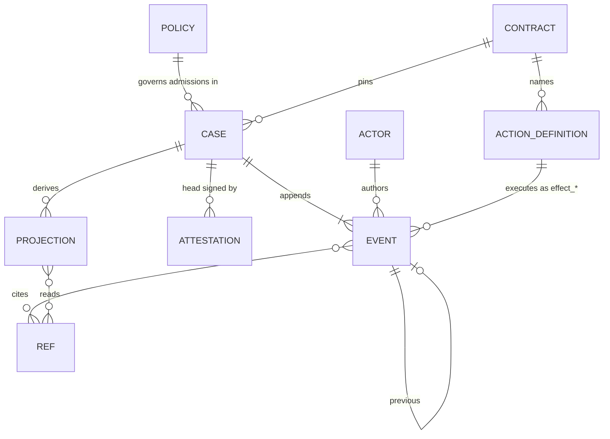
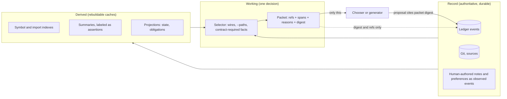
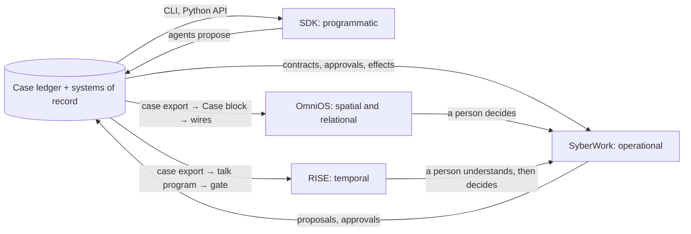
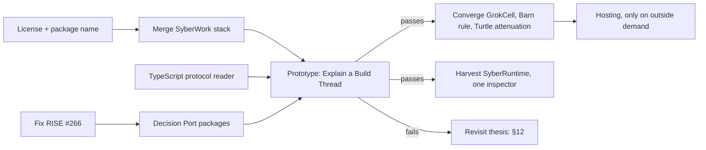

# SyberLabs Master Architecture

Proposal, 28 September 2026. Scope: every SyberLabs and `sykosyber` repository that touches agents, execution, context, evidence, or the three interfaces (RISE, OmniOS, SyberWork), including open pull requests.

Claim grades used throughout:

- **MEASURED**: I ran it in this review, or read a number a named run recorded.
- **IMPLEMENTED**: code and tests exist on `main` or on a named open branch.
- **INTENT**: a README, plan, or roadmap says so; no code does it.
- **PROPOSED**: this document recommends it.

---

## 0. Verdict

1. **SyberLabs is a portfolio today, not a platform.** It has a shared vocabulary (proposal, admission, evidence, replay, park) and a shared method ("systems that touch the real world should be built so they cannot fool the people who use them"). It has no shared data model. No two products read the same record.
2. **The method is implemented at least nine times.** The "a proposal is not authority; an effect is idempotent and reconcilable; completion needs independent evidence; the log replays" pattern exists separately in SyberWork, the `syberlabs` SDK, SyberRuntime, Barn, GrokCell, `grokcell-execution`, Relay's agent runtime, COMMONS, and OmniOS PR #25. About 33,000 non-test lines on default branches implement it, with about 10,000 more in open pull requests. Three of those pull requests (OSAHR #29 and #34, OmniOS #25) were opened on the same day.
3. **The canonical kernel already exists.** The `syberlabs` package in the open SyberWork stack (PRs #3 and #5–#12) is the most complete, most honestly specified, and best-tested version: a frozen protocol (`sdk.syberlabs.space/v0alpha1`), golden traces, a clean-install gate, a signed chain head, a Build Thread over Git, and a model seam that imports no model SDK. MEASURED here: 173 unit tests pass and 23 golden traces match at `abd0b91`. Make it canonical. Stop building the others.
4. **Replace the proposed three-layer stack.** "Object/state → semantic/context → operational" puts two layers of stored truth under the one layer that has authority. The evidence supports a different shape: **systems of record → one ledger → disposable projections**, with proposers outside the stack and every interface reading projections.
5. **JEV is not a SyberLabs layer.** JEV is TypeSafe's hosted model (`typesafe/jev-1.13` through OpenRouter). SyberLabs is migrating to Kev, Jared Palmer's open 4B decision model. Both answer typed choice questions over a bounded state. Their correct role is a **Chooser behind a Decision Port**: pick one option from a list the host already made legal. They never admit, execute, verify, or remember.
6. **Context is assembled per decision, cited, and digested.** Three tiers by authority, not by recency: Record (ledger and systems of record), Derived (rebuildable caches), Working (one packet per decision, stored only as references and a digest). The Build Thread already stores context this way. OmniOS's rule that a persona knows only what its wires carry is the right selector. Opaque, count-capped memory pools should go.
7. **The interface hypothesis mostly holds, with two corrections.** RISE is temporal and must keep its reading path independent of the platform. OmniOS is not an inspector today; it is a context-composition canvas, which is more useful. It becomes the spatial view by reading case exports through its existing block-normalizer path.
8. **The highest-information prototype is "Explain a Build Thread"**: one real governed change to a real repository, shown in OmniOS as wired blocks a persona can answer from and in RISE as a talk program whose every card cites a ledger event. About ten working days. Section 11 lists what would falsify it.
9. **Next five actions:** decide the license and package split (owners' call); merge the SyberWork stack; fix RISE #266's provider bypass; freeze new runtime work in OSAHR/GrokCell, `grokcell-execution`, OmniOS #25, and COMMONS #12 until the prototype reports; build the prototype.

---

## 1. What was examined

| Repository | Read | Open PRs examined |
| --- | --- | --- |
| SyberLabs/SyberWork | `main`, the full stacked branch to `abd0b91`, specs, docs, tests (ran) | #2, #3, #5, #6, #7, #8, #9, #10, #11, #12 |
| SyberLabs/RISE | `main` (`3334208`), worker, server, enterprise, core, services/rise-api, Kev deploy | #172, #174, #178, #233, #264 (merged during review), #266, #270, #276, #277, #278 |
| SyberLabs/OmniOS | `main`, memory, ledger, jev-persona route | #16, #17, #25 |
| SyberLabs/omni-agent, sykosyber/omni-neo | `main` | none open |
| SyberLabs/OSAHR_Cell | kernel, GrokCell, workbench, docs (ran tests) | #23, #29, #34 (identified from GitHub merge refs; API listing was not available for this repository) |
| SyberLabs/grokcell-execution | `main`, roadmap | |
| sykosyber/syber_runtime | `main` (last commit 2026-08-20), docs (ran tests) | none |
| sykosyber/bough-and-barn | Barn and Bough (ran both suites), integration plan | none |
| SyberLabs/relay | architecture, agent runtime, context-management | #209, #210, #212, #215, #218 (merge refs, as above) |
| SyberLabs/commons | system design, core, integrations | #4, #5, #7, #12, #19 |
| SyberLabs/cross-platform | instrument panel | #1 |
| SyberLabs/turtle-shells, SyberLabs/construct | README, spec | |
| SyberLabs/ontology, SyberLabs/.github, SyberLabs/papers | vault, org profile, PR decisions | |

Not found: a repository or module named EvoGit. The EvoGit work is SyberWork PR #8 (`syberlabs/evolve.py`), an independent implementation of the published method. "Operational Module" appears once, in SyberWork's `docs/ROADMAP_STATUS.md`, as the pairing of a versioned contract with its actions.

### Tests run in this review (MEASURED, Linux, CPython 3.11)

| System | Result | Note |
| --- | --- | --- |
| SyberWork stack tip `abd0b91` | 173 passed; 23 golden traces matched | `unittest`, `conformance.run` |
| OSAHR_Cell kernel | 127 passed, 1 skipped | `pytest tests` |
| Barn | 62 passed | Needs the `dev` extra (`pytest-asyncio`); without it 39 async tests fail to collect |
| Bough | 34 passed | |
| SyberRuntime | 77 passed, 6 failed | Failures are Windows-shaped (`%VAR%` expansion) and the acceptance audit returning `fail` instead of `ready_with_warnings` |

RISE's suite (about 3,800 tests) was not rerun here. PR #266 reports 3,858 passed and PR #264 reports 3,678 passed.

---

## 2. Current-state architecture

### 2.1 Repositories

| Repository | What it is (from code) | Stack | Status | Verdict |
| --- | --- | --- | --- | --- |
| **RISE** | Public browser reader. Atoms, Player, Chamber, Page, Experience Program. Cloudflare Worker for decision routes. EnterpRISE: prepared talk with speaker rail. `services/rise-api`: Go job API for future narration. | JS, Vite, Workers, Go | Live at rise.syberlabs.io; heavy daily activity | Keep. The temporal interface and the public product. |
| **SyberWork** | Contract executor: versioned contracts and policy, case hash chain, admission, HTTP effects with reconciliation, resolution tasks. Open stack adds the `syberlabs` SDK. | Python stdlib, SQLite | Main is the app; SDK is in 10 stacked open PRs | Canonical kernel (SDK) plus operational interface (app). |
| **OmniOS** | Canvas: data blocks, wires, personas. A persona's context is its inbound wires. IndexedDB local state; optional Postgres inference ledger with lineage. | Next.js, TS | Active; public preview on Workers | Keep as the spatial interface. |
| **omni-agent** | Keyless loopback browser-affordance surface (tabs, click, type, screenshot). | Next.js, TS | Split from OmniOS on 2026-09-01 | Keep separate; later a browser executor. |
| **omni-neo** | OmniOS fork with Neo4j graph memory. | TS | Last push 2026-09-12 | Archive. |
| **OSAHR_Cell** | Exact stochastic typed-hypergraph rewriting kernel, experiments, decision workbench, GrokCell agent control plane. | Python | Active | Kernel stays research. GrokCell control plane converges on the SDK. |
| **grokcell-execution** | GrokCell's READ → DECIDE → CALL → CHECK → ADMIT runtime extracted as a package; SQLite snapshots. | Python | Sprint 1 done | Converge on the SDK or retire. |
| **SyberRuntime** | Operation-primary kernel: verbs (Feature, Test, Stabilize), content-addressed artifacts, verification debt, Merkle proofs, PROV and RO-Crate export. | Python | Dormant since 2026-08-20; 6 of 83 tests fail on Linux | Harvest ideas into the SDK, then archive. |
| **Barn** | Work and crew graph; spawn, reuse, retire licensed by a deterministic engine; artifact plus independent verification closes work; replay audit. | Python, FastAPI, optional Neo4j | 62/62 tests | Move its spawn rule onto the SDK; keep the repository experimental. |
| **Bough** | Offline compiler of OSAHR rule systems into exact jump chains and optimal policies. | Python | 34/34 tests | Research tool. Advisory only. |
| **Relay** | Job-application product: canonical job identity, fact ledger, exact-draft acceptance, handoffs to ChatGPT, Claude, Obsidian, a Chrome operative. | React, Vinext, Workers, D1 | Active product | Independent product. Merge PR #210, which deletes its duplicate agent runtime. |
| **COMMONS** | Mission workspace: evidence versions, version-bound completion claims, independent review, command receipts. | Next.js, Prisma, Postgres | Prototype | Independent product; pause kernel expansion. |
| **cross-platform** | Instrument panel that imports SyberRuntime, Barn, Bough, OSAHR and runs Relay as a sidecar, with source-line provenance per event. | Python, SPA | Open PR #1 adds a typed solution builder | Fold its best idea (event → source line) into one inspector; park the builder. |
| **turtle-shells** | Rust P0 authority-envelope evaluator: grants, deny precedence, delegation attenuation, simulated shared budgets. Protocol `turtle.syberlabs.space/v0alpha1`. | Rust | P0 | Its attenuation rule is valuable. It must not remain a second policy protocol. |
| **construct** | 3D factory editor that compiles typed machine graphs to 2D architecture diagrams. | TS | V0.x | Independent experiment. |
| **ontology** | Obsidian vault of organizational memory. "No type catalog and no ID spine." | Markdown | Stale: no project notes for SyberWork, COMMONS, Barn, Bough, SyberRuntime | Keep as human memory. Do not build an ontology system. |

### 2.2 Code dependencies that actually exist



Every arrow between SyberLabs systems is either a research pin (Bough → OSAHR), an extraction or fork, or a demonstration harness (cross-platform). No product reads another product's records. RISE, OmniOS, and COMMONS each depend on the same external decision provider through separately written code.

### 2.3 Duplicated responsibilities

**The governed-effect pattern.** Each row independently implements some of: a proposal separate from authority, a deterministic legality check, idempotent effects with unknown outcomes, reconciliation, independent verification, an append-only record, and replay.

| Implementation | Where | Non-test lines | Proposal ≠ authority | Unknown outcome + reconcile | Independent verification | Hash chain / replay |
| --- | --- | ---: | :-: | :-: | :-: | :-: |
| `syberlabs` SDK + SyberWork app | SyberWork stack | 6,279 + 1,232 | yes | yes | yes (host checks, independent approver) | yes, plus signed head and transparency log |
| SyberRuntime | syber_runtime | 7,849 | yes (adapters propose) | no | yes (verification debt) | yes, Merkle proofs |
| Barn | bough-and-barn | 4,172 | yes | no | yes (verifier ≠ producer) | replay audit |
| GrokCell | OSAHR_Cell | 3,854, plus about 3,600 in PRs #29 and #34 | yes (bus, park) | yes (`outcome_unknown`) | yes (host oracle) | replay of admission |
| grokcell-execution | own repository | 1,355 | yes (chooser) | yes | yes (trusted verifier) | SQLite snapshot |
| Relay agent runtime | relay `lib/agent-runtime-*` | 2,280 | yes (park) | yes (settle polls) | no | no |
| COMMONS core | commons (+4,875 in PR #12) | 118 on main | yes | no | yes (independent review) | audit events |
| OmniOS PR #25 | OmniOS | +1,216 | no | yes (uncertain, no redispatch) | no | lineage only |
| RISE | `services/rise-api` (Go), `rise.agent-operation-set.v1`, EnterpRISE gate | 636 + 2,638 | yes | idempotency only | EnterpRISE citation gate | trace, not chain |
| Turtle | turtle-shells | 3,009 | policy only | no | no | no |

**The decision-provider selector** is written three times: RISE `server/decision-provider.mjs`, OmniOS `app/api/jev-persona/route.ts`, COMMONS `packages/integrations`. They disagree on configuration names (`OMNI_KEV_ENABLED` exists only in OmniOS) and on policy (COMMONS escalates JEV below confidence 0.8; RISE refuses to forward confidence at all). RISE PR #266 then adds a fourth path, `worker/jev-visual-score.mjs`, that calls OpenRouter directly with the TypeSafe model and skips RISE's own selector.

**Typed graph composition surfaces:** OmniOS canvas (block wires, ports display-only), cross-platform solution builder (typed ports, exact matching), construct (typed machine ports), Barn graph with a Neo4j projection, Bough automaton with a Neo4j export, omni-neo Neo4j memory, OSAHR hypergraph. None shares a schema.

**Inspectors:** SyberWork inspector (PR #12), SyberRuntime `inspector.py`, cross-platform instrument panel, OmniOS canvas, Relay Inspect, grokcell-execution `inspect`, GrokCell `surface.inspect`.

**Protocols:** `sdk.syberlabs.space/v0alpha1` (SyberWork) and `turtle.syberlabs.space/v0alpha1` (Turtle) both define authority. Both reserve shared budgets (`economic.reserve` versus Turtle's simulated shared-domain budgets).

### 2.4 Inconsistencies between claims and code

1. **RISE PR #266 contradicts the Kev migration.** The org profile says Jev is an explicit rollback. `server/decision-provider.mjs` enforces that. The new `jev-visual-score.mjs` reads `OPENROUTER_API_KEY` and accepts only `provider === 'TypeSafe'`, so the visual score cannot move to Kev by configuration. Fix before merge.
2. **Stale Jev direction.** `grokcell-execution/docs/roadmap.md` still says "JEV chooses among permitted actions". RISE PR #178 routes reading decisions to Jev on a path RISE removed in #181. Relay PRs #209 and #212 (a Jev-priority README note and a Jev experiment) predate the Kev move and are still open.
3. **OmniOS's own rule is broken in one place.** The product claims "what does this thing know" has a literal answer. Its roadmap admits Mind-panel Think reads every stored block across shells, and empty sources produce placeholder text that can be cited. The persona path is sound; the Mind path is not.
4. **Integration claims are mostly honest, but the org map is not.** Bough & Barn says "the integration is a plan, not wired code", and SyberWork's architecture says adapters are required before integration can be claimed. Both are correct. The org profile and the ontology vault omit SyberWork, COMMONS, SyberRuntime, Barn, and Bough, so the organization's written memory does not describe where most recent engineering went.
5. **cross-platform depends on a dormant kernel.** It imports SyberRuntime, which has not changed since August, fails 6 tests on Linux, and needs `core.autocrlf=false` to keep an evidence hash stable.
6. **Language split with no bridge.** The kernel is Python. RISE, OmniOS, Relay, and COMMONS are JavaScript or TypeScript on Cloudflare Workers, where Python does not run. SyberWork publishes JCS vectors (`conformance/jcs_vectors.json`) but no TypeScript verifier exists.
7. **No license on the kernel.** SyberWork has no `LICENSE` file. Its own roadmap notes that this blocks any outside adoption test.
8. **Speculative infrastructure on unauthenticated prototypes.** COMMONS PR #12 designs Monad chain commitments and EAS shapes while hosted writes are still disabled and real authentication is the next ticket.

---

## 3. Core thesis

**SyberLabs makes computational work legible and governable.** One small kernel records what was observed, what was proposed and by whom, what was licensed, what was done, and what verified it. Several interfaces let people and agents see (OmniOS), follow (RISE), govern (SyberWork), and program (SDK) that same record, and none of them can make the record say more than it does.

What is distinctive, by comparison with systems that solve adjacent problems:

| System | Solves | Does not solve | SyberLabs difference |
| --- | --- | --- | --- |
| Temporal, Restate | Durable execution and retries | Whether an action was legal, or whether a model may request it | Owns the license to execute, not the execution engine |
| Cedar, OPA | Allow or deny | Whether the write happened; case history | Admission, effect outcome, and evidence are separate records |
| in-toto, SLSA, Sigstore | Signed provenance of build steps | Live decisions against a changing policy | Uses the same envelope ideas (DSSE, transparency log) for work cases |
| LangGraph, agent SDKs, MCP | Model picks and calls tools | Stale facts, missing approvals, unknown outcomes | A model returns a proposal and holds no executor credential |
| Jujutsu | An operation log for version control | Governance of who may move which ref | Build Thread uses Git refs as the effect and the ledger as the operation log |
| LangSmith, OpenTelemetry | Traces of what ran | Authority; a trace cannot refuse | The ledger is the trace and the gate |
| Observable, marimo | Reactive dataflow, visible dependencies | Governed effects | OmniOS wires already show dataflow; the prototype adds governed provenance |

The combination nobody ships: proposer-agnostic governance (a person, a compiled path, a model, and an evolutionary search all produce the same `Proposal`), host-owned verification, reconcilable effects, and explanations that are forbidden from citing anything outside the record (EnterpRISE's gate), all local-first.

**What SyberLabs should not become:**

- A general agent framework or orchestration runtime.
- A durable workflow engine. Use Temporal or Restate if retries and worker failover are needed.
- A policy language. Keep admission rules in code with named rule ids; borrow Cedar's discipline, not its scope.
- A memory or knowledge-graph platform, a vector store, or an ontology system.
- An attestation network or chain integration before one external user needs third-party verification.
- A hosted multi-tenant service before one external team completes the local quickstart.
- An "intelligence layer" through which every call passes.

---

## 4. Canonical architecture

### 4.1 Testing the proposed three-layer stack

| Proposed layer | Verdict | Evidence |
| --- | --- | --- |
| Object/state: what exists | **Rejected as a stored layer.** What exists already lives in systems of record (Git, source systems, the reader's browser, provider APIs). A SyberLabs object store would be a second source of truth. | OmniOS `INFERENCE_LEDGER.md`: "A second store is a second source of truth." SyberWork: "The source systems remain authoritative." SyberRuntime: "artifacts as projections." |
| Semantic/context: what it means | **Kept, demoted to a projection.** Meaning is computed from records by deterministic extractors and assembled per decision. It holds no authority and can be deleted and rebuilt. | RISE axiom 4: "Structure is read, never inferred." RISE's import graph is generated from `src/` and CI fails if the committed copy drifts. The Build Thread stores context as references and a digest. |
| Operational/runtime: what is legal and done | **Accepted, and it is the trunk.** It is the only layer with authority. | Every governance implementation in §2.3 converges on this shape. |

### 4.2 The target shape



### 4.3 Primitives

Five nouns, one envelope with a closed set of event kinds, and three derived objects. Everything else in the requested list collapses into these.

| Primitive | Definition | Owner | Invariants | Home today |
| --- | --- | --- | --- | --- |
| **Actor** | A principal with roles. `kind` is `human` or an automation kind (`model`, `compiled`, `search`, `service`). | Organization (policy) | An automation kind can propose, never promote or approve. An actor cannot verify its own output. | SDK roles and proposal `origin` |
| **Ref** | A pointer into a system of record: `{system, id, version or digest}`. Git commit and tree, source record plus ETag, blob digest, URL plus content hash. | The system of record | Immutable once recorded. A Ref without version or digest cannot license anything. | SDK observations and candidates, SyberRuntime `ArtifactRef`, COMMONS `EvidenceVersion` |
| **Contract** | Immutable `(id, version)`: inputs, action rules, bindings, acceptance, optional resolutions and evolution section. | Workflow owner | Bytes never change under a version. A case stays pinned. Cannot widen policy. | SDK |
| **Policy** | Versioned organizational grants: which roles may take which actions, approvals, limits, budgets, retention, delegation. | Organization | Monotonic versions. A contract cannot widen it. Delegation only attenuates. | SDK policy; attenuation from Turtle |
| **Case** | One bounded unit of work under one contract with one log. A Build Thread is a case over a Git repository. | Whoever creates it; history owned by the ledger | Append-only; causal within the case. | SDK `Session`, SyberWork `Work` |
| **Event** | Envelope `{case_id, seq, kind, body, at, previous, hash}`. Kinds: `observed`, `proposed`, `candidate_registered`, `decision`, `approved`, `effect_started`, `effect_succeeded`, `effect_rejected`, `effect_unknown`, `reconciled`, `candidate_evaluated`, `signed`, `resolution_*`, `case_cancelled`, `forgotten` (tombstone). | Kernel | The hash covers every field but itself. New kinds need a protocol version. | SDK `protocol.py` (21 kinds) |
| **Projection** (derived) | A deterministic function of events and Refs: current state, open obligations, candidate status, semantic graph, context packet, sequence. | Whoever computes it | Carries the digests of its inputs. Deletable. Never an input to admission unless recomputed from the log. | SDK `inspect`, `candidates`, `status` |
| **Packet** (derived) | The Working context for one decision: Refs, excerpt spans, the reason each was chosen, and a digest. | Host | Persisted only as references plus digest; text is re-read from the record. | Build Thread `context` |
| **Attestation** (derived) | A DSSE signature over `{case_id, count, head}` plus an optional transparency-log entry. | Witness process | Not an event and not inside the hash. | SDK `dsse.py`, `witness.py`, `tlog.py` |

**Collapsed:** Project → a configuration directory (`.syberlabs/`), not an object. Object, Resource, Artifact → Ref. Claim → an asserted observation (`verified: false`) or a proposal. Evidence → a role, not a type: a verified observation or host evaluation that an admission rule cites. Semantic relation → an edge in a projection. Agent → Actor with an automation kind, plus the events it produced. Capability → ActionDefinition. Authority → Policy roles. Module → a distributable bundle of Contract, ActionDefinitions, and checks. Workflow → a contract's compiled path. State and Snapshot → projection and checkpoint. Sequence → a RISE projection. Memory → human-authored `observed` events plus Derived caches.

**Look alike, must stay separate:**

- Admission decision, effect outcome, and evaluation. Legal, happened, and holds are three different questions.
- Verified and asserted observations. Typing a fact is not reading it from a source.
- Approval (before an effect) and signoff (after it).
- Candidate lineage and candidate evidence. A crossover child of two passing parents has no evaluation of its own.
- A RISE reader's local work and a Case. The reader's text never enters a ledger.
- OSAHR committed events and ledger events. One is simulation time in a model; the other is wall-clock history of real work.

### 4.4 Data and state model



- **Local first.** A case lives in a journal file or SQLite database next to the work (`.syberlabs/`). No server, account, or network is needed. MEASURED by SyberWork's clean-install gate.
- **Hosted later.** Postgres becomes a store only when multiple users share a case. The event envelope does not change.
- **One writer per case.** Commit serializes recheck and effect claim (SQLite `BEGIN IMMEDIATE`; a re-entrant lock in `Session`).
- **Digests.** The chain link stays today's canonical JSON so histories from `main` still verify. New events also carry an RFC 8785 digest on a side record. A second protocol version switches the link.

### 4.5 Execution model

```mermaid
sequenceDiagram
  participant P as Proposer (person, Kev, generator, search)
  participant K as Kernel (admission + log)
  participant A as Approver (human role)
  participant X as Executor (installed action)
  participant R as System of record
  participant V as Verifier (host check / independent actor)
  P->>K: propose {action, args} or candidate (Git commit)
  K->>K: append proposed; admit → decision {allowed | needs_approval | denied, rule}
  V->>R: run checks on the exact tree
  V->>K: candidate_evaluated
  A->>K: approved (independent of proposer)
  K->>K: commit: recheck admission, claim (effect_started)
  K->>X: execute with idempotency key
  X->>R: write (If-Match / compare-and-swap)
  alt known result
    X->>K: effect_succeeded or effect_rejected (declared no-write)
  else unknown
    X->>K: effect_unknown; action stays occupied
    K->>R: status lookup by idempotency key
    K->>K: reconciled only with verified proof
  end
  A->>K: signed (signoff; not the actor who started the effect)
  K->>K: witness signs head
```

| Question | Answer |
| --- | --- |
| What proposes | People, compiled contract paths, Choosers, generators, search providers. All produce `proposed` or `candidate_registered`. |
| What decides legality | Admission: a pure function over contract, policy, history, proposal, and time. MEASURED at 3.5 µs per allowed decision (reported by SyberWork's benchmark). |
| What authorizes | Policy roles and, where required, an independent human approval event. |
| What executes | An installed ActionDefinition. Its URL, method, and credential are fixed at install; a proposer cannot supply them. |
| What mutates authoritative state | Executors mutate systems of record. The kernel mutates only its own log. |
| What records | The kernel, in the same transaction as the claim. |
| What verifies | Host-run checks on exact Refs and independent actors. A proposer's claim that tests pass is displayed as unverified and never read by admission. |
| What replays | Admission against any historical prefix with a different contract or policy version. Replay makes no model calls, source reads, or destination writes. |
| What fails closed | Unknown effects, missing credentials, unversioned sources, stale facts, a Chooser answer outside its options, provider timeouts, unknown contract fields, schema mismatch, a chain mismatch. |

### 4.6 Semantic model

- **Deterministic extractors produce meaning.** Git tree and diff, path and symbol index (`git grep` today, as in `syberlabs/retrieval.py`), import graph (the method of RISE's `scripts/build-architecture-diagram.mjs`), test-to-file maps, contract-to-action graphs. Use tree-sitter or SCIP when symbol precision matters; do not write a parser.
- **Every extractor output is a Projection** stamped with the digests of its inputs, so staleness is detectable and rebuilds are cheap.
- **Model-written meaning is an assertion.** A model may label a module "authentication" or summarize a diff. That lands as an asserted observation and can be displayed, but admission cannot cite it.
- **No graph database in the core.** Neo4j exporters (Barn, Bough, omni-neo) become optional projection adapters.
- **No ontology system.** The ontology vault says "wikilinks and folders are the join." Keep that for people.

### 4.7 Context model



Rules:

1. **Context is assembled, not accumulated.** A Packet is built for one decision from Record and Derived by an explicit selector, and discarded. Only its digest and Refs are kept, in the proposal event. MEASURED as implemented: Build Thread `context` records path, blob id, line range, byte count, and reason, and never stores excerpt text.
2. **Selectors are visible and editable.** OmniOS wires, `syberlabs context --drop`, and EnterpRISE's `{evidence, structure, authority}` shape are the three existing selectors. The person can see and remove every source.
3. **Minimum disclosure.** A Chooser sees the legal options and the facts the contract names, not the whole case. SyberWork closed this for its planner in the SDK red-team pass.
4. **Memory is a human act.** A preference or note is an `observed` event authored by a person. A model may propose one; a person accepts it. OmniOS's count-capped pools (observations 100, inferences 50, predictions 30, directives 20, insights 200) are opaque accumulation and should be retired.
5. **Forgetting is policy.** Retention rules delete case events after their period, keep a receipt when an effect must stay provable, and leave a tombstone. IMPLEMENTED in SyberWork PR #11. Derived caches can be deleted at any time.
6. **Cross-agent context is the shared ledger, not shared prompts.** A second agent reads the same case and builds its own packet.
7. **Cross-interface context is a Case id plus Refs.** OmniOS, RISE, and SyberWork share a contract for packets and citations. They do not share a store. RISE's reader data never leaves the browser (RISE axiom 1), so a shared store would break RISE's first constraint.

### 4.8 The Decision Port (JEV's correct role)

Kev's served API ("System One") takes a `state` and typed `questions` and returns answers. TypeSafe's Jev behind OpenRouter's decisions API has the same shape. EnterpRISE already defines the right request: evidence (what was observed), structure (the legal options), and authority (what the decider may do), with promotion never delegated.

```text
DecisionRequest  { schema, request_id, packet_digest,
                   evidence: {...bounded facts},
                   questions: { name: { type: "choice", options: [...] } },
                   authority: ["choose"] }
DecisionResult   { request_id, answers: { name: option }, provider, model, revision }
```

Host rules: pin provider, model, and revision on the server; verify the revision header on every answer (RISE's `X-Kev-Revision`); reject any answer outside its options; no fallback between providers; timeout means no decision, and the contract says what happens next; cache by keyed digest of the request (RISE already does this in Redis without storing raw intent); record `provider`, `revision`, and `packet_digest` in the proposal event.

**Appropriate uses:** routing a request to one of several legal formats (Scriptorium), choosing an edition and plan from an admitted catalog (Library), choosing among the compiled contract's next legal actions, triage into typed categories, choosing a mutation operator in search, persona suggestion.

**Never:** admission, approval, promotion, verification, reconciliation, memory writes, free-form state, confidence scores that gate an action (COMMONS's `confidence < 0.8` rule should go), anything in a hazard function (OSAHR's own rule).

One package, two languages: `syberlabs.decide` (Python) and `@syberlabs/decide` (TypeScript), each under 300 lines, replacing the three hand-written selectors.

---

## 5. Component responsibilities

| Component | Role in target | Action | Proposed owner (confirm) |
| --- | --- | --- | --- |
| **`syberlabs` SDK** | The kernel: protocol, admission, log, witness, Build Thread, providers, checks, publish, retention | Canonical. Split into its own distribution after the name is chosen. | Mateo Robles (author of the stack) |
| **SyberWork app** | Operational interface: console, HTTP sources and effects, economic actions, resolution tasks | Keep, on the SDK | Mateo Robles |
| **Operational Modules** | Distributable bundles: contract + ActionDefinitions + checks (`repo-change`, `release-gate`, `access-review`, `purchase-order`) | Define a bundle format in the SDK | Kernel owner |
| **JEV / Kev** | External Choosers behind the Decision Port | Kev primary once verified; Jev explicit rollback | RISE owner (current Kev migration lives in RISE) |
| **SyberRuntime** | None as a runtime | Harvest into the SDK: verification debt as an obligations projection, Merkle inclusion and consistency proofs for the transparency log, PROV and RO-Crate exporters, mutation-testing check, blob shredding. Then archive. | Kernel owner |
| **Barn** | Source of one admission rule | Re-express "no specialist without an unresolved obligation requiring its capability" as a `spawn_actor` contract on the SDK. Keep the repository experimental. | Kernel owner |
| **Bough** | Offline advisor | Research tool. Its output may enter as an asserted observation, never a decision. | Research |
| **OSAHR kernel** | Research engine ("mechanism twin") | Independent. Not in the platform path. | Research |
| **GrokCell, grokcell-execution** | None separately | Map `admit`/`hold`/`reject`/`outcome_unknown` onto SDK decisions and effects (the table exists in `spec/MAPPINGS.md`). Stop PRs #29, #34 and Sprint 2 in their current form. | Seth Carlson (PR author) with kernel owner |
| **Turtle** | Specification of delegation attenuation and enforcement plans | Fold attenuation into SDK Policy under one protocol namespace. Keep the Rust evaluator only if it becomes the reference evaluator for that policy. | Decide |
| **OmniOS** | Spatial interface; canonical context selector | Add a read-only Case block source. Retire Mind-panel global context and the capped pools. Postpone hosting (#25). | Current OmniOS owner |
| **omni-agent** | Future browser executor | Keep separate; later an ActionDefinition kind | Same |
| **RISE** | Temporal interface and public product | Add a talk-program compiler input from case exports, behind the existing EnterpRISE gate. Reading path stays independent. | Seth Carlson |
| **Relay** | Independent product | Merge #210. Adopt the SDK only if a real need appears. | Seth Carlson (Relay lead) |
| **COMMONS** | Independent product | Pause PR #12 chain and model work; finish authentication first | Owner decision |
| **cross-platform** | Retired as a separate panel | Move "open the source line that produced this event" into the inspector. Park PR #1. | Decide |
| **ontology** | Human organizational memory | Update project notes. No platform role. | Both |

---

## 6. System invariants

1. The ledger is the only SyberLabs-owned authority. Everything else is a system of record owned elsewhere or a projection.
2. A projection never feeds admission unless recomputed from the log at decision time.
3. Every model output enters as a proposal or an assertion. No model output changes state, authority, or evidence.
4. No proposer holds an executor credential. Destinations are fixed when an ActionDefinition is installed.
5. Admission is deterministic and replayable. The same contract, policy, history, proposal, and time give the same decision and rule id.
6. Commit rechecks admission and claims the effect in one serialized step.
7. An effect that started and has not reached success, declared rejection, or verified reconciliation occupies its action.
8. `allowed` never means "happened"; `succeeded` never means "correct".
9. Only a host evaluation of the exact Ref counts as evidence. Lineage, provider signals, and confidence scores never do.
10. An actor never verifies or signs off its own effect. Automation kinds never approve or promote.
11. Contracts and ActionDefinitions are immutable under their version or name. Policy versions advance.
12. A contract cannot widen policy. Delegation cannot widen the delegator.
13. Context is assembled per decision from visible sources and persisted only as Refs and a digest.
14. Every displayed claim in any interface cites a record. A number shown must occur in the cited source (EnterpRISE rule).
15. Absent is not failure; unknown is not success. Silence outranks approximation (RISE axiom 2).
16. Forgetting follows written retention and leaves a tombstone. No history is rewritten; no hash is recomputed in place.
17. Protocol changes get a new version. Old histories keep verifying.
18. A reader's material stays on the reader's device unless the reader sends it (RISE axiom 1).

---

## 7. End-to-end flows

### Flow A: a repository change, from understanding to explanation

This is the requested flow, corrected so that no step has hidden authority.

| # | Step | Component | Records |
| --- | --- | --- | --- |
| 1 | `syberlabs init` and `start "Route visual scores through decisionProvider" --paths worker server` on RISE | SDK | `case_created`, base commit as verified `git` observation |
| 2 | Deterministic projection: import graph and symbol index of the scoped paths | SDK projection | nothing (derived, digest-stamped) |
| 3 | OmniOS shows the case as blocks: objective, scope, files, import edges | OmniOS Case block | nothing |
| 4 | A person wires the files block and the objective into a persona and asks "what calls OpenRouter directly?" The answer cites the files the wire carries. | OmniOS; optional inference ledger | OmniOS ledger row with lineage |
| 5 | A generator (Claude through `CommandProvider`) proposes two candidates | SDK Build Thread | `search_started`, 2 × `candidate_registered` (commits on non-authoritative refs), `search_finished` |
| 6 | Host runs RISE's checks on each exact tree | SDK checks | 2 × `candidate_evaluated` |
| 7 | Kev chooses which passing candidate to recommend (a choice among two legal options) | Decision Port | recommendation recorded as a signal, not a decision |
| 8 | A person accepts c2 | SDK | `proposed` (human origin), `decision allowed`, `effect_started`, `effect_succeeded` (compare-and-swap of `refs/heads/syberlabs/<thread>`) |
| 9 | `syberlabs publish push_branch`, then `github_pull_request` | SDK publish | separate admitted effects with idempotency and reconciliation |
| 10 | Witness signs the head | SDK witness | DSSE envelope, transparency-log entry |
| 11 | OmniOS refreshes: the case block shows accepted, published, signed | OmniOS | nothing |
| 12 | RISE plays a talk program compiled from the case: objective, candidates, checks, decision, effect. Every card cites event hashes; the gate refuses any uncited number. | RISE EnterpRISE | nothing |

### Flow B: a RISE Library recommendation (existing, mapped)

Reader request → Worker builds a DecisionRequest from the admitted catalog → Kev or Jev chooses an edition and a bounded Chamber plan → Worker resolves names to shipped values → browser validates the complete plan (`validateJevRecommendation`) → preview with "what RISE can't do here" → reader adjusts locally → play. This uses the Decision Port and no ledger. That is deliberate: a reading is not governed work, and RISE's reading path must not depend on the platform.

### Flow C: spawning an agent (Barn's rule on the SDK)

Open obligation (a required check with no passing evaluation) → proposal `spawn_actor {capability, obligation}` → admission requires the obligation to be open, no idle actor with the capability, and the new actor's policy to be an attenuation of the spawner's → effect registers the Actor → the actor's candidates go through Flow A steps 5–8 → `retire_actor` when the obligation closes. Barn's "why does this agent exist" becomes a ledger query: the spawn effect cites the obligation.

### Flow D: an agent as an inspectable actor

An actor card is a projection over the ledger: kind, provider and revision, roles, objective (its case), packet digests, proposals, budget used, evaluations of its candidates, refusals with rule ids, effects it started, and time since last event. OmniOS renders it as a block; SyberWork's inspector renders it as a panel; RISE can narrate it. Chat is one input channel for proposals, not the interface to the agent.

---

## 8. SDK architecture

### 8.1 Packages

| Package | Contents | Languages | Status |
| --- | --- | --- | --- |
| `syberlabs-protocol` | JSON Schemas, event envelope, canonical and JCS digests, chain verification, CloudEvents export | Python (exists), TypeScript (verifier and reader only, new) | Python implemented; TypeScript proposed |
| `syberlabs` | `Session`, admission rules, journal, witness, transparency log, retention | Python | Implemented in the open stack |
| `syberlabs.build` | Build Thread, providers (`Patch`, `Command`, `Function`, `Evolutionary`), checks, publish | Python (same distribution for now) | Implemented in the open stack |
| `syberlabs.decide` / `@syberlabs/decide` | Decision Port clients: Kev, Jev, static, and a test double | Python, TypeScript | Proposed; replaces three selectors |
| `syberlabs.view` | Projections: state, obligations, actor cards, packet, talk-program compiler | Python; exports read by TypeScript | Proposed |
| `syberwork` | Application: storage, HTTP API, console, connectors, economic actions | Python | Implemented |

Rule: the kernel imports nothing from the application (`tests/test_package.py` already enforces this), no model SDK, and no third-party runtime dependency.

**Why no TypeScript kernel.** RISE, OmniOS, Relay, and COMMONS run on Workers. Porting admission would create a second implementation to keep in sync. Until a TypeScript product has a demonstrated need to admit actions (none does today), TypeScript gets the protocol, verification, and the Decision Port only. If a port becomes necessary, the 23 golden traces are its specification.

### 8.2 Levels of abstraction

| Level | For | Example |
| --- | --- | --- |
| Primitives | People building a new kind of governed work | `Session.install_contract`, `observe`, `propose`, `commit`, `explain`, `replay` |
| Modules | Teams with a known workflow | `repo-change.v1`, `release-gate`, `access-review`, `purchase-order`: contract + actions + checks |
| Experiences | Everyone else | `syberlabs start/propose/check/accept/publish`, SyberWork console, OmniOS Case block, RISE talk program |

### 8.3 API sketch

```python
from syberlabs import Kit
from syberlabs.providers import CommandProvider
from syberlabs.decide import Chooser          # proposed

kit = Kit.local(".syberlabs")
thread = kit.start("Route visual scores through decisionProvider",
                   contract="repo-change.v1", paths=["worker/", "server/"])
candidates = thread.propose(CommandProvider(["./claude-adapter"]))
verdicts = [thread.check(c.id) for c in candidates]

pick = Chooser.from_env().choose(            # a signal, never a decision
    question="recommend", options=[c.id for c, v in zip(candidates, verdicts) if v.acceptable],
    packet=thread.packet())
receipt = thread.accept(pick.answer)         # human-origin; admission decides
thread.publish("push_branch")
kit.export(thread.id, format="cloudevents")  # read by OmniOS and RISE
```

### 8.4 Extension points

| Extension | Contract | Example |
| --- | --- | --- |
| ActionDefinition executor | Idempotency key in, `{state, output}` out; optional status lookup; declared no-write codes | Git ref, HTTP, publish command, economic HTTP, browser (omni-agent) |
| SourceDefinition reader | Record key in, `{value, version}` out; unversioned response refused | HTTP source, Git, file |
| Provider | Receives a `SearchSpace` only; returns candidates | `CommandProvider` JSON over stdin/stdout |
| Check | argv, scrubbed environment, timeout, output cap; exit 0 passes | project tests, mutation testing (from SyberRuntime) |
| Chooser | DecisionRequest → DecisionResult | Kev, Jev, static |
| Projection and exporter | Events + Refs → view, stamped with input digests | actor card, talk program, PROV, RO-Crate, Neo4j |
| Store | Append, read, lock | journal file, SQLite, later Postgres |

### 8.5 Developer experience

- Ten minutes from install to first verdict; 186 ms machine time to first verdict on the fixture (reported). The adoption test with unfamiliar developers is not yet measured.
- Every refusal has a rule id and a `hint()`. `explain` answers "why" without writing. `contract-diff` shows what a new version changes.
- `Session` runs in memory for tests; golden traces and the `main`-history fixture catch behavior drift.
- Observability: the ledger is the trace. An OpenTelemetry exporter is a projection, not a second log.
- Versioning: protocol version on the side record; dual digests during migration; conformance vectors for other languages.

---

## 9. Architecture diagrams

The HTML edition of this document carries five drawn diagrams (system, runtime flow, context flow, object model, interface relationships). The Mermaid diagrams above cover the same content:

- System level: §4.2
- Runtime flow: §4.5
- Context flow: §4.7
- Object model: §4.4
- Interface relationships:



---

## 10. Migration plan

### Phase 0: decide and stop (this week)

| Item | Why |
| --- | --- |
| Choose a license for SyberWork and the SDK distribution name | Owners' decision; blocks outside adoption |
| Merge the SyberWork stack #5 → #12 after review; close #2 and #3 as superseded by #5 | #5 already integrates both |
| Fix RISE #266 to go through `decisionProvider`, then merge | Removes the only code path that cannot move to Kev |
| Close RISE #178, Relay #209 and #212, OSAHR #23 | Jev-first work that the Kev direction superseded |
| Merge Relay #210 | Deletes a duplicate agent runtime (about 12,000 lines removed) |
| Freeze OSAHR #29 and #34, grokcell-execution Sprint 2, OmniOS #25, COMMONS #12 | Four new durable-admission implementations; wait for the prototype |
| Archive omni-neo; mark SyberRuntime read-only after the harvest list is filed | Dormant duplicates |
| Update the ontology vault's project notes and the org profile | Written memory should match the code |

### Phase 1: prove it (two weeks)

1. Build the prototype in §11.
2. `@syberlabs/protocol` TypeScript reader and chain verifier against `conformance/jcs_vectors.json`.
3. `syberlabs.decide` and `@syberlabs/decide`; replace the RISE, OmniOS, and COMMONS selectors.

### Phase 2: converge (after the prototype passes)

1. GrokCell and grokcell-execution admission onto the SDK, using the existing mapping; then retire their runtimes.
2. Barn's spawn rule as an SDK contract (Flow C).
3. One protocol namespace: fold Turtle's attenuation into SDK Policy.
4. SyberRuntime harvest: obligations projection, Merkle proofs, PROV and RO-Crate exporters, mutation check.
5. Inspector: one read-only view, with cross-platform's source-line links.

### Phase 3: host (only after an outside team completes the local quickstart)

Postgres store, real identity (OIDC), the witness on a separate host, OmniOS #25's identity work, multi-user cases.

### Postpone

Neo4j in the core, chain attestation, embeddings, distributed evolutionary search, OSAHR-driven scheduling in Barn, the cross-platform solution builder, a TypeScript admission port.

### Remove

Duplicate governance runtimes after convergence, OmniOS Mind-panel global context and capped memory pools, the direct OpenRouter path in RISE #266, COMMONS confidence-threshold routing.



---

## 11. Highest-information prototype: "Explain a Build Thread"

**Question it answers:** can one ledger feed a spatial view and a temporal view with no additional store, service, or model-held authority, and does either view help a person understand governed work better than the CLI?

**Work item:** the real fix from §2.4 item 1 (route RISE's visual score through `decisionProvider`), done as a Build Thread on the RISE repository.

**New code, in order:**

| Piece | Where | Estimate |
| --- | --- | --- |
| `syberlabs export --format cloudevents` projection with actor cards | SDK | ~150 lines |
| `@syberlabs/protocol` reader and verifier | new package | ~250 lines |
| OmniOS Case block source and normalizer (read-only, file or loopback URL) | OmniOS `src/blocks` | ~250 lines |
| Case → `rise.talk-program.v1` compiler; corpus = events as documents | RISE `src/enterprise` | ~250 lines |
| Claude adapter for `CommandProvider` | script | ~80 lines |

**Pass criteria:**

1. OmniOS: a persona wired only to the Case block answers five fixed questions (why was c2 accepted, what checks ran, who approved, what was published, what failed) and every cited source is an event hash in the case. No answer uses data outside the wires.
2. RISE: the talk program compiles with zero gate refusals, and a deliberately uncited number is refused.
3. The chain verifies in both Python and TypeScript.
4. No new server, database, or long-running service is required. Each adapter stays under about 300 lines.
5. Three people who did not build it answer the same five questions using (a) `syberlabs status` and the inspector, (b) OmniOS, (c) RISE. Record time and correctness.

**Falsifiers:**

- OmniOS or RISE needs a fact that is not in the ledger or a system of record: the primitives are incomplete.
- An adapter needs a shared service or second store: "one log, many projections" does not hold for local-first.
- Neither view beats the CLI on time or correctness in criterion 5: the interfaces are decoration for this use.
- The Build Thread quickstart takes an unfamiliar developer more than 15 minutes: the kernel's experience is not ready to be the platform.

---

## 12. Production-readiness gaps

| Area | Today | Needed |
| --- | --- | --- |
| Security | Loopback binding, token hashes, no redirects, fixed destinations, SSRF checks at install and request (IMPLEMENTED). Ed25519 is pure Python and not constant-time; the witness runs as the same OS user. | A vetted signature library once a dependency is acceptable; witness under a separate user or host; threat model for the Decision Port. |
| Permissions | Locally provisioned role tokens. No SSO, no tenancy. No delegation attenuation. | Attenuation (from Turtle); OIDC for hosted cases. |
| Testing | Golden traces, `main`-history fixture, clean-install gate, schema validation (MEASURED). Barn's dev extra is not installed by default. SyberRuntime fails on Linux. | TypeScript conformance against the same vectors; the adoption test with outside developers. |
| Observability | The ledger and `explain`. OmniOS inference ledger with lineage. RISE EnterpRISE trace. | One actor-card projection; optional OpenTelemetry exporter. |
| Schema evolution | Frozen `v0alpha1`, dual digests, old rows verify. `GAPS.md` lists 22 differences between schema and code. | Close `GAPS.md` items before `v0beta1`; enforce schemas at install. |
| Performance | Admission 3.5 µs; in-memory case 0.54 ms; SQLite case 37 ms under FULL sync (reported). | Fine for human-paced work. Batch or WAL only with a stated durability trade. Keep model calls out of the admission path. |
| Failure recovery | Crash before or after a ref write recovers without duplicate effects; unknown effects block (IMPLEMENTED and tested). | Operator runbook for unknown outcomes; backup and restore drill. |
| Deployment | Local single installation. RISE deploys on merge to `main`. | Nothing hosted for the kernel until Phase 3. |
| Multi-user | Not supported. | Postgres store with the same envelope; per-case single writer. |
| Licensing | No license on SyberWork. | Owners' decision. |

---

## 13. Adversarial critique

**Strongest arguments against this architecture:**

1. **Two people, seventeen repositories, and a kernel no outside developer has used.** Consolidation onto an SDK is itself a platform bet. The simpler plan is to ship RISE and Relay and let everything else sit. This proposal only survives if the prototype shows the interfaces add understanding; otherwise stop at "RISE is the product".
2. **Python kernel, JavaScript products.** Every product that users touch runs on Workers. A Python kernel may never be on their path, and the "shared record" could stay a demo. The TypeScript reader is cheap; a TypeScript admission port is not.
3. **Governance ceremony can make development worse.** Contracts, policies, approvals, and signoffs for every change is bureaucracy for a two-person lab. The Build Thread's value must be visible in minutes, and the default contract must be one file with one check.
4. **The duplication may be healthy exploration.** Agents built nine versions cheaply. Converging costs human attention, which is the scarce resource. Counter: every duplicate also carries its own security surface and its own Jev-to-Kev migration, as RISE #266 shows.
5. **Spatial and temporal views of a case log may not be what anyone wants.** Most developers read diffs and CI results. If OmniOS and RISE views lose to `git log` plus a PR page, the three-interface thesis is wrong for developer work, though RISE remains valid for reading.
6. **External Choosers are a thin moat.** Kev and Jev belong to others. SyberLabs' contribution is the port and the gate, which are small. That is acceptable only if the product is the governed record, not "AI decisions".

**How this becomes an elaborate collection of abstractions:**

- Building the protocol TypeScript port, the Decision Port, the inspector, and the module format before the prototype runs.
- Adding a projection store, a graph database, or a hosted service to make an interface work.
- Letting "Actor", "Module", and "Packet" become classes with lifecycles instead of views over events.
- Counting passing unit tests as adoption.
- Writing more roadmaps and specs across repositories than code in the kernel.

**Evidence that would falsify the thesis:**

- The prototype falsifiers in §11.
- A second product (Relay or COMMONS) tries to adopt the protocol and finds the envelope cannot express its core records without a new event kind per feature.
- Outside developers finish the quickstart but do not return for a second change.
- The Decision Port's Kev path, once live, is not better than a static rule on RISE's existing 39-case comparison, which would show the Chooser role adds cost without value in the one product using it.

---

## 14. Master Reference Checklist

| Item | Result |
| --- | --- |
| First principles | The axiom is one authoritative record per unit of work. Every other layer was tested against it; two proposed stored layers were demoted to projections. |
| Algorithm | Questioned every requirement (object layer, semantic layer, JEV as substrate); deleted eight duplicate runtimes, three selectors, a fork, and a dormant kernel; simplified to five nouns; acceleration (the prototype) and automation (hosting, TypeScript port) come after. |
| Lean machine | No new service, database, or dependency in Phases 0–1. |
| Communication | Bad news first: portfolio not platform; nine duplicates; RISE #266 bypass; no license. |
| Ownership | One owner proposed per part (§5), marked for confirmation. The license and package name are the owners' calls. |
| Semantic tree | Trunk: ledger and admission. Branches: projections, proposers, executors. Leaves: interfaces. |
| Usefulness and delight | Judged by §11 criterion 5, not by this document. |
