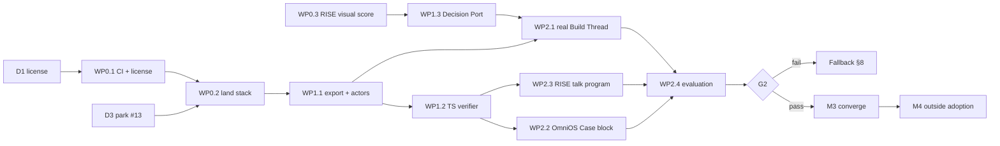

# SyberLabs Next Phase Implementation Roadmap

> **For agentic workers:** REQUIRED SUB-SKILL: Use superpowers:subagent-driven-development (recommended) or superpowers:executing-plans to implement this plan task-by-task. Steps use checkbox (`- [ ]`) syntax for tracking. Each work package (WP) is one branch and one pull request in one repository, built in its own worktree.

**Goal:** Land the SyberWork SDK as the one SyberLabs ledger, put every Jev/Kev call behind one Decision Port, and prove or disprove in four weeks that one case record can drive OmniOS and RISE views that help people understand governed work.

**Architecture:** Systems of record → one hash-chained case log (the `syberlabs` SDK) → disposable projections read by the interfaces. Models only propose. OmniOS reads case exports as a block; RISE compiles them into a cited talk program. No new server, database, or protocol namespace in this phase.

**Tech stack:** Python 3.11+ stdlib (`syberlabs`, `syberwork`); zero-dependency ES modules vendored into RISE (Vite, Cloudflare Workers) and OmniOS (Next.js, TypeScript); GitHub Actions.

**Spec:** [`docs/MASTER_ARCHITECTURE.md`](../../MASTER_ARCHITECTURE.md) (same branch). Section numbers below (§) refer to it.

## Global constraints

- `syberlabs` imports nothing from `syberwork`, no model SDK, and no third-party runtime dependency (`tests/test_package.py`).
- The protocol stays `sdk.syberlabs.space/v0alpha1` through M2. A field change to a hashed object needs a new protocol version.
- Stored hashes are never rewritten. Histories from SyberWork `main` (`a2f909b`) must keep verifying.
- RISE's reading path gets no new network dependency. RISE first-load budget: 64 KB brotli (`npm run measure:first-load`).
- Only `server/decision-provider.mjs` (RISE) and the vendored Decision Port module may name a provider URL.
- Production RISE stays on Jev until `KEV_PRODUCTION_VERIFIED=true` (RISE `.github/workflows/ci.yml:70`).
- Vendored JavaScript follows the existing pattern: RISE `src/vendor/`, OmniOS `src/vendor/syber/`. Each vendored file carries a header line `// vendored from SyberLabs/SyberWork <path> @ <commit>`.
- No new repository, no new protocol namespace, no hosted service. Any new "admit / effect / verify" code goes into `syberlabs`, not a product repository.
- Work-in-progress limit: two open work packages per person.

---

## 1. Where things stand (28 September 2026)

| Item | State | Consequence |
| --- | --- | --- |
| SyberWork stack #5 → #12, then #13, #14 | Complete, all draft, unmerged. `main` is still the pre-SDK app. | M0 lands it. |
| SyberWork CI | **None.** No `.github/workflows`. | Nothing gates a merge. Add CI before landing. |
| SyberWork license | **None.** | Outside adoption blocked. Owner decision D1. |
| SyberWork #13 multi-host evolution | Built (415 lines, 6 tests). No second host or user exists. | Architecture §10 postpones distributed search. Park it (D3). |
| SyberWork #14 model-vs-patch harness | Built; only a simulated run; stacked on #13. | Rebase onto #12. Real run is budgeted in M3. |
| RISE #266 | **Merged 07:29 today.** `worker/jev-visual-score.mjs` calls OpenRouter directly and accepts only TypeSafe. | Live bypass of the Kev migration. Fixed first (WP0.3). |
| RISE production provider | `wrangler.production.jsonc` sets `DECISION_PROVIDER: "jev"`. | Routing through `decisionProvider()` changes nothing in production today. |
| Relay #210 | Open. Deletes the duplicate agent runtime (12,420 lines). | Merge in M0. |
| Stale Jev PRs | RISE #178, Relay #209, #212, OSAHR #23 | Close in M0. |
| New runtime work | OSAHR #29, #34; grokcell-execution Sprint 2; OmniOS #25; COMMONS #12 | Freeze until gate G2. |

## 2. Decisions the owners must make

| # | Decision | Needed by | Recommendation |
| --- | --- | --- | --- |
| D1 | License for SyberWork / `syberlabs` | Oct 2 | Apache-2.0: matches Turtle and Kev, grants patents, and keeps the EvoGit-style provider an independent implementation of the published method. |
| D2 | Package distribution names (PyPI, npm) | Nov 16 | `syberlabs` on PyPI; `@syberlabs/protocol`, `@syberlabs/decide` on npm. Check availability before announcing. |
| D3 | SyberWork #13 multi-host | Oct 2 | Park the branch; do not merge. Revisit only when a second host exists. |
| D4 | Turtle's future | Oct 26 | Fold delegation attenuation into SDK Policy; keep the Rust evaluator only as a differential reference. |
| D5 | Owners per work package | Oct 2 | Table in §3 (proposed from PR authorship). |
| D6 | Model spend | Oct 12 | Cap prototype and harness spend (suggest $100 total for M2 and M3; measure one repeat first). |

## 3. Milestones and gates

| Milestone | Dates | Work packages | Exit gate |
| --- | --- | --- | --- |
| **M0 · Land and stop** | Tue Sep 29 – Fri Oct 2 | WP0.1–WP0.5 | **G0:** SDK stack on SyberWork `main` behind green CI; no code outside `decision-provider.mjs` names a provider URL in RISE; stale PRs closed; freezes posted. |
| **M1 · Shared contracts** | Mon Oct 5 – Fri Oct 9 | WP1.1–WP1.3 | **G1:** export schema frozen with a golden file; TypeScript verifier passes all Python-generated vectors; RISE and OmniOS use one Decision Port module. |
| **M2 · Explain a Build Thread** | Mon Oct 12 – Fri Oct 23 | WP2.1–WP2.4 | **G2 (Oct 23):** prototype criteria, §7. Pass → M3. Fail → §8 fallback. |
| **M3 · Converge** (only after G2 passes) | Mon Oct 26 – Fri Nov 13 | WP3.1–WP3.6 | **G3:** governance implementations reduced from nine to the SDK plus two product-local ones (RISE rise-api jobs, Relay acceptance); one inspector. |
| **M4 · Outside adoption** | Mon Nov 16 – Wed Nov 25 | WP4.1–WP4.3 | **G4 (Wed Dec 2):** 2 of 3 unfamiliar developers finish the quickstart and change a contract within 15 minutes; at least one returns for a second change within a week. |

Proposed owners (confirm, D5): **M** = Mateo Robles, **S** = Seth Carlson.

| WP | Title | Repo | Owner | Depends on |
| --- | --- | --- | --- | --- |
| 0.1 | CI and license | SyberWork | M | D1 |
| 0.2 | Land the SDK stack | SyberWork | M (review S) | 0.1, D3 |
| 0.3 | Route visual scores through the Decision Port | RISE | S | none |
| 0.4 | Pull-request hygiene and freezes | all | repo owners | none |
| 0.5 | Organizational memory | ontology, .github | M | 0.2 |
| 1.1 | Export schema and actor cards | SyberWork | M | 0.2 |
| 1.2 | TypeScript protocol verifier | SyberWork (`ts/`) | S | 1.1 |
| 1.3 | Decision Port module | SyberWork (`ts/`, `syberlabs/`), RISE, OmniOS | S (Python part M) | 0.3 |
| 2.1 | A real Build Thread on OmniOS | OmniOS via `syberlabs` | M | 0.2, 1.1, D6 |
| 2.2 | OmniOS Case block | OmniOS | M | 1.1, 1.2 |
| 2.3 | RISE case talk program | RISE | S | 1.1, 1.2 |
| 2.4 | Evaluation session and G2 | SyberWork (`docs/evaluations/`) | M (observer S) | 2.1–2.3 |



---

## 4. M0 · Land and stop (Sep 29 – Oct 2)

### WP0.1: CI and license (SyberWork)

**Files:**
- Create: `.github/workflows/ci.yml`
- Create: `LICENSE` (text per D1), `NOTICE`
- Modify: `pyproject.toml` (add `license` field)

**Interfaces:**
- Produces: a required check named `CI` on `main`, which every later SyberWork WP must pass.

- [ ] **Step 1: Write the workflow.** Base it on the SDK stack tip so the commands exist.

```yaml
name: CI
on: { pull_request: {}, push: { branches: [main] } }
jobs:
  python:
    runs-on: ubuntu-latest
    strategy: { matrix: { python: ["3.11", "3.12", "3.13"] } }
    steps:
      - uses: actions/checkout@v4
      - uses: actions/setup-python@v5
        with: { python-version: "${{ matrix.python }}" }
      - run: PYTHONPATH=. python -m unittest discover -s tests -q
      - run: PYTHONPATH=. python -m conformance.run
      - run: PYTHONPATH=. python -m spec.validate --golden
      - run: python -m conformance.clean_install
```

- [ ] **Step 2: Run locally on the stack tip** (`claude/wizardly-shannon-rv6l5x-inspector`, `abd0b91`).
  Run each command above. Expected: `Ran 173 tests … OK`, `matched 23 golden traces`, schema OK, clean install OK. MEASURED on 28 Sep: the first two pass.
- [ ] **Step 3: Open the PR against `main`** containing only the workflow, `LICENSE`, `NOTICE`, and `pyproject.toml`. Its CI run on `main` code will skip SDK-only commands that do not exist yet; gate the three SDK commands on `if: hashFiles('conformance/run.py') != ''`.
- [ ] **Step 4: Protect `main`:** require `CI`; require merge commits or rebase merges (no squash) so the stacked PRs retarget cleanly.
- [ ] **Step 5: Merge.**

**Acceptance:** `CI` is a required check on SyberWork `main`; `LICENSE` exists.

### WP0.2: Land the SDK stack (SyberWork)

**Order:** #5 → #6 → #7 → #8 → #9 → #10 → #11 → #12 → #14 (rebased). #13 stays parked (D3). #2 and #3 close as superseded by #5.

- [ ] **Step 1: Rebase #14 onto #12 without #13.**

```bash
git fetch origin
git switch -c claude/model-comparison-on-12 origin/claude/wizardly-shannon-rv6l5x-model-comparison
git rebase --onto origin/claude/wizardly-shannon-rv6l5x-inspector \
  origin/claude/wizardly-shannon-rv6l5x-multihost
```

  Expected conflicts: `syberlabs/evolve.py` and `syberlabs/search.py` where #14 touched migration ("a migrant fills an unfilled slot"). Drop migration-only hunks; keep "continues with a population under 2", the duplicate-tree refusal, the mutator call cap, and the stop-when-exhausted rule.
- [ ] **Step 2: Verify the rebased branch.**
  Run: `PYTHONPATH=. python -m unittest discover -s tests -q && PYTHONPATH=. python -m conformance.run`
  Expected: all pass except `tests/test_multihost.py`, which must not exist on this branch; 23 golden traces match. If `benchmarks/results/*` quote multi-host numbers, regenerate them with `benchmarks/model_vs_patch.py` in simulated mode.
- [ ] **Step 3: Push the rebased branch; open it as #14's replacement with base `claude/wizardly-shannon-rv6l5x-inspector`; close #14 with a link.**
- [ ] **Step 4: Review and merge in order.** For each PR: mark ready, wait for `CI`, approve, merge with a merge commit, delete the head branch so GitHub retargets the next PR to `main`. Do not squash: the children contain the parents' commits.
- [ ] **Step 5: Close #2 and #3** with a comment pointing to #5, and close #13 with "parked per D3; branch kept".
- [ ] **Step 6: Merge `docs/MASTER_ARCHITECTURE.md` and this roadmap** from `claude/amazing-mayer-izke6w` in a docs-only PR.
- [ ] **Step 7: Verify `main`.** Run the WP0.1 commands on `main`. Expected: all pass; `syberlabs --help` lists `export`, `inspect`, `forget`.

**Acceptance:** SyberWork `main` contains the SDK; CI green; #2, #3, #13, #14 closed with links.

### WP0.3: Route visual scores through the Decision Port (RISE)

The bypass is live. Production sets `DECISION_PROVIDER=jev`, so this change keeps today's behavior and lets the visual score follow Kev when `KEV_PRODUCTION_VERIFIED` flips.

**Files:**
- Modify: `worker/jev-visual-score.mjs` (drop `API_URL`, `OPENROUTER_API_KEY`, and the TypeSafe-only check)
- Modify: `worker/jev-visual-score.test.js`
- Create: `worker/provider-boundary.test.js`
- Modify: `src/components/Chamber.js:1793` (consent copy), `PRIVACY.md`, `public/privacy.html` (provider named accurately)

**Interfaces:**
- Consumes: `decisionProvider(env)`, `validProviderResult(value, provider)`, `validProviderResponse(response, provider)`, `decisionIdentity(provider)` from `server/decision-provider.mjs`. The request body stays `{ model, state, questions }`, the same shape `worker/jev-recommend.mjs` sends to either provider.
- Produces: `POST /api/jev-visual-score` responses carrying `model` plus `decisionIdentity(provider)`.

- [ ] **Step 1: Write the failing tests** in `worker/jev-visual-score.test.js`, beside the existing `scoreRequest`, `environment`, `providerAnswer`, and `body` helpers. The existing Jev test stays as the rollback case.

```js
const KEV_REVISION = 'a'.repeat(40);

function kevEnvironment(overrides = {}) {
  return { ...environment(), DECISION_PROVIDER: 'kev', KEV_API_KEY: 'kev-secret',
    KEV_BASE_URL: 'https://kev.example/', KEV_REVISION, ...overrides };
}

function kevResponse(count, header = KEV_REVISION) {
  return Response.json(
    providerAnswer(count, { provider: 'Kev', model: 'kev-latest', revision: KEV_REVISION }),
    { headers: { 'x-kev-revision': header } });
}

it('sends the visual score to Kev when Kev is configured', async () => {
  const provider = vi.fn(async () => kevResponse(2));
  vi.stubGlobal('fetch', provider);
  const response = await worker.fetch(scoreRequest(await body()), kevEnvironment());
  expect(response.status).toBe(200);
  expect(await response.json()).toMatchObject({ model: 'kev-latest', provider: 'Kev', revision: KEV_REVISION });
  const [url, init] = provider.mock.calls[0];
  expect(url).toBe('https://kev.example/v1/systemone');
  expect(init.headers.Authorization).toBe('Bearer kev-secret');
  expect(JSON.parse(init.body).model).toBe('kev-latest');
});

it('refuses a Kev answer from a different checkpoint', async () => {
  vi.stubGlobal('fetch', vi.fn(async () => kevResponse(2, 'b'.repeat(40))));
  const response = await worker.fetch(scoreRequest(await body()), kevEnvironment());
  expect(response.status).toBe(502);
});

it('is unavailable when Kev is selected but not configured', async () => {
  const provider = vi.fn();
  vi.stubGlobal('fetch', provider);
  const response = await worker.fetch(scoreRequest(await body()), kevEnvironment({ KEV_API_KEY: '' }));
  expect(response.status).toBe(503);
  expect(provider).not.toHaveBeenCalled();
});
```

- [ ] **Step 2: Write the boundary test** `worker/provider-boundary.test.js`.

```js
import { readdirSync, readFileSync } from 'node:fs';
import { join } from 'node:path';
const ALLOWED = new Set(['server/decision-provider.mjs']);
function files(dir) {
  return readdirSync(dir, { withFileTypes: true }).flatMap(entry =>
    entry.isDirectory() ? files(join(dir, entry.name)) : [join(dir, entry.name)]);
}
it('only the decision provider names a provider URL', () => {
  const offenders = ['worker', 'server', 'netlify'].flatMap(files)
    .filter(path => /\.(mjs|js)$/.test(path) && !path.endsWith('.test.js'))
    .filter(path => !ALLOWED.has(path))
    .filter(path => /openrouter\.ai|\/v1\/systemone/.test(readFileSync(path, 'utf8')));
  expect(offenders).toEqual([]);
});
```

- [ ] **Step 3: Run and see both fail.**
  Run: `npx vitest run worker/jev-visual-score.test.js worker/provider-boundary.test.js`
  Expected: the Kev tests fail (the request goes to OpenRouter); the boundary test lists `worker/jev-visual-score.mjs`. If `netlify/functions` still names OpenRouter, list it in the PR and add it to `ALLOWED` only with a comment and follow-up issue.
- [ ] **Step 4: Implement.** In `handleJevVisualScore` (`worker/jev-visual-score.mjs:159`): `const provider = decisionProvider(env)`; return 503 `DECISION_NOT_CONFIGURED` when null; `fetch(provider.url, { headers: { Authorization: \`Bearer ${provider.key}\` }, body: JSON.stringify({ ...buildVisualScoreDecision(request), model: provider.model }) })`; reject with 502 unless `validProviderResponse(response, provider)`; in `choicesFromProvider` replace the TypeSafe check with `validProviderResult(value, provider)`; add `...decisionIdentity(provider)` to the response. Keep the limiter binding check, timeout, LRU cache, and no-store headers unchanged. Include `provider.revision` in the LRU cache key.
- [ ] **Step 5: Run the focused tests.** Expected: pass.
- [ ] **Step 6: Consent copy.** Change the button to name the destination the reader is consenting to without claiming a specific model: "Send this reading to RISE's decision service to direct its visuals." Update `PRIVACY.md` and `public/privacy.html` to say the service is Jev (TypeSafe via OpenRouter) or Kev (SyberLabs-hosted) depending on configuration. Update any e2e selector that matches the old text.
- [ ] **Step 7: Run the PR gates.**

```bash
node scripts/ci-hygiene.mjs && npm run security:audit && npm run security:compat \
  && npx vitest run src/core/system-design.test.js && npm run docs:diagram \
  && git diff --exit-code docs/specs/ARCHITECTURE.md && npm run build \
  && npm run measure:first-load && npm run test:e2e:gate
```

- [ ] **Step 8: Open the PR, pass `CI` and `Agentic review`, merge.** After deploy, call `/api/jev-visual-score` once on production with a catalog passage and confirm `model` starts with `typesafe/jev-1.13`.

**Acceptance:** The boundary test passes on `main`; production visual scores still answer via Jev; switching `DECISION_PROVIDER` moves them.

### WP0.4: Pull-request hygiene and freezes (all repositories)

- [ ] Close RISE #178 ("superseded by `decision-provider.mjs` and the Kev migration").
- [ ] Merge Relay #210 after its CI passes.
- [ ] Close Relay #209 and #212, OSAHR #23 ("Jev-first work superseded by the Kev direction").
- [ ] Comment on OSAHR #29 and #34, OmniOS #25, COMMONS #12, and grokcell-execution's Sprint 2 issue: "Frozen until SyberLabs gate G2 (Oct 23). Durable admission and replay converge on the `syberlabs` SDK; see `SyberWork/docs/MASTER_ARCHITECTURE.md` §10." Add a `frozen-g2` label.
- [ ] Merge or close remaining dependency PRs (COMMONS #4, #5, #7; OmniOS #16, #17) per each repo's normal rule.

**Acceptance:** No open Jev-first PR; every frozen PR carries the label and the comment.

### WP0.5: Organizational memory (ontology, .github)

- [ ] Add `obsidian-vault/projects/SyberWork.md`, `COMMONS.md`, `Bough-and-Barn.md`, `SyberRuntime.md` (status: archived after harvest), `grokcell-execution.md`, `Turtle.md`, each with one paragraph and a link to `MASTER_ARCHITECTURE.md`.
- [ ] Run `python tools/check.py` and `python -m unittest discover -s tests -v` in `ontology`. Expected: pass.
- [ ] Add SyberWork to the org profile's "Selected work" table in `.github/profile/README.md`.

**Acceptance:** Vault check passes; profile lists SyberWork.

---

## 5. M1 · Shared contracts (Oct 5 – Oct 9)

### WP1.1: Export schema and actor cards (SyberWork)

`syberlabs export` already writes `{status, contract, events, side, chain_valid}` (`syberlabs/build.py` `Kit.export`). This WP freezes that shape and adds the one projection the interfaces need.

**Files:**
- Create: `syberlabs/views.py`
- Modify: `syberlabs/build.py` (`Kit.export`), `syberlabs/cli.py` (`export --format json|cloudevents`)
- Create: `spec/export.schema.json`; modify `spec/validate.py`, `spec/SPEC.md`
- Create: `tests/test_export.py`, `conformance/golden/export_build_thread.json`

**Interfaces:**
- Produces: `syberlabs.views.actor_cards(events: list[dict], side: list[dict]) -> list[dict]` where each card is `{actor, origins: list[str], roles: list[str], proposals: int, candidates: list[str], evaluations: {passed: int, failed: int}, refusals: list[{seq, reason, rule}], effects_started: list[int], provider_revisions: list[str], packet_digests: list[str], last_seq: int}`.
- Produces: export document `{export_version: "sdk.syberlabs.space/v0alpha1+export1", case_id, status, contract, events, side, chain_valid, actors}`. `events` are unchanged envelopes.
- Produces: `syberlabs export --format cloudevents` writes one `syberlabs.interop.cloudevent(event)` per line.

- [ ] **Step 1: Failing test for actor cards** in `tests/test_export.py`, using the thread built by `examples/build_thread.py` (import its builder or replicate its three calls): assert one card for the provider actor with `candidates` equal to the registered candidate ids and `evaluations.passed` equal to the passing checks, and one human card holding the accept proposal.
- [ ] **Step 2: Failing test for the schema:** `spec.validate` accepts `kit.export(thread.id)` and rejects it with `actors` removed.
- [ ] **Step 3: Failing golden test:** export of the example thread, with ids and timestamps normalized by the existing conformance normalizer, equals `conformance/golden/export_build_thread.json`.
- [ ] **Step 4: Run; expect failures** (`ModuleNotFoundError: syberlabs.views`).
- [ ] **Step 5: Implement** `actor_cards` as a pure fold over events; read `rule` from the side record by `seq`. Add `export_version`, `case_id`, `actors` in `Kit.export`. Add `--format`.
- [ ] **Step 6: Generate the golden file once** with the capture script, review it by eye, commit.
- [ ] **Step 7: Run the full CI command set.** Expected: all pass; 23 existing golden traces unchanged.

**Acceptance:** `spec/export.schema.json` frozen; golden export committed; CI green.

### WP1.2: TypeScript protocol verifier (SyberWork `ts/protocol/`)

**The trap to design around:** the chain link is Python `json.dumps(sort_keys=True, separators=(",", ":"), ensure_ascii=False)`. `JSON.parse` loses number spelling (`1.0` becomes `1`) and JavaScript's default sort compares UTF-16 code units, not code points. A verifier built on `JSON.parse` + `JSON.stringify` will reject valid histories. The verifier therefore parses the export text itself, keeps each number's original lexeme, and sorts keys by code point.

**Files:**
- Create: `ts/protocol/package.json` (`"type": "module"`, no dependencies), `ts/protocol/src/index.js`, `ts/protocol/test/protocol.test.js`
- Create: `conformance/make_ts_vectors.py`, `conformance/ts_vectors.json`
- Modify: `.github/workflows/ci.yml` (add a `node` job: Node 22, `node --test ts/protocol/test`)

**Interfaces:**
- Produces (`ts/protocol/src/index.js`):
  - `parseLossless(text: string): Value` where numbers are `{ $num: "<lexeme>" }`
  - `canonicalPython(value: Value): string`
  - `eventDigest(event: Value): string` (hex SHA-256 via Web Crypto, async)
  - `verifyExport(text: string): Promise<{ valid: boolean, checked: number, firstBad: number | null, reason: string | null }>`
  - `jcsDigest(value: Value): Promise<string>` checked against side records when present
  - `toPlain(value: Value): unknown` for display only

- [ ] **Step 1: Generate vectors from Python.** `conformance/make_ts_vectors.py` writes cases for: integer and float numbers (`1.0`, `250.0`, `-0.0`, `1e-07`), non-ASCII keys including U+E000 and U+1F600, control characters in strings, nested objects, a full export from `examples/build_thread.py`, a legacy event with float-second `at`, and one tampered export. Each case stores the input text and the expected `canonical` output and digest.
- [ ] **Step 2: Failing tests** in `protocol.test.js` that iterate the vectors: `canonicalPython(parseLossless(input)) === expected`, digests match, the good export verifies, the tampered one fails at the right `seq`.
- [ ] **Step 3: Run; expect failures.** `node --test ts/protocol/test`
- [ ] **Step 4: Implement** a small recursive-descent JSON parser (strings, numbers as lexemes, literals, arrays, objects); `canonicalPython` with code-point key order (`[...a].map(c => c.codePointAt(0))` comparison), Python's escape set (`\"`, `\\`, `\n`, `\r`, `\t`, `\b`, `\f`, other `< 0x20` as `\u00XX`), non-ASCII unescaped; `eventDigest` over the same field list as `syberlabs/events.py` `DIGEST_FIELDS`.
- [ ] **Step 5: Run; expect pass.** Add the `node` CI job.

**Acceptance:** every vector passes in Node 22; CI runs it on each PR.

### WP1.3: Decision Port module (SyberWork `ts/decide/` and `syberlabs/decide.py`; vendored into RISE and OmniOS)

**Files:**
- Create: `ts/decide/src/index.js`, `ts/decide/test/decide.test.js`
- Create: `syberlabs/decide.py`, `tests/test_decide.py`
- RISE: replace `server/decision-provider.mjs` body with a re-export from `src/vendor/syberlabs-decide.js` (keep the file path so imports and the WP0.3 boundary test stay valid)
- OmniOS: create `src/vendor/syber/decide.js`; modify `src/app/api/jev-persona/route.ts` and its test

**Interfaces:**
- Produces (JS and Python, same names): `decisionProvider(env)`, `validProviderResult(value, provider)`, `validProviderResponse(headers, provider)`, `decisionIdentity(provider)`, and `validateChoices(answers, questions) -> boolean` (every answer is one of its question's declared options).
- Environment names, shared: `DECISION_PROVIDER` (`kev` | `jev`), `KEV_API_KEY`, `KEV_BASE_URL`, `KEV_REVISION`, `KEV_MODEL`, `OPENROUTER_API_KEY`. OmniOS keeps `OMNI_KEV_ENABLED` / `OMNI_JEV_ENABLED` as a product switch in front of the shared module.
- Python adds `Chooser.from_env().choose(question: str, options: list[str], packet_digest: str) -> {"answer", "provider", "model", "revision"}` using `urllib`; used in WP2.1 as a recommendation signal.

- [ ] **Step 1: Copy RISE's existing tests for `decision-provider.mjs`** into `ts/decide/test/` as the starting spec; add `validateChoices` cases. Write the same cases in `tests/test_decide.py`.
- [ ] **Step 2: Run; expect failures.**
- [ ] **Step 3: Implement** by moving RISE's `server/decision-provider.mjs` logic into `ts/decide/src/index.js` unchanged, then add `validateChoices`. Port to Python line for line.
- [ ] **Step 4: Vendor into RISE;** run `npx vitest run worker server` and the RISE PR gates (WP0.3 step 7).
- [ ] **Step 5: Vendor into OmniOS;** make the route use it; run `npm run typecheck && npm test && npm run lint`.
- [ ] **Step 6 (only with COMMONS owner's consent):** in `commons/packages/integrations/src/index.ts`, stop accepting Jev routes on `confidence >= 0.8`; accept only validated choices, the same rule for Kev and Jev. Run `pnpm test`.

**Acceptance:** RISE and OmniOS route every decision through one vendored module with a pinned header; Python `Chooser` passes its tests.

---

## 6. M2 · Explain a Build Thread (Oct 12 – Oct 23)

### WP2.1: A real Build Thread on OmniOS

Work item, a real bug from OmniOS `APEX_PLAN.md` §3.1: *"Empty data arrays and empty Memory pools currently produce placeholder text that can still be cited as a source. Return no source for empty content."*

- [ ] **Step 1:** In a fresh OmniOS clone: `pip install <syberlabs wheel from main>`, `syberlabs init`.
- [ ] **Step 2:** Edit `.syberlabs/contracts/repo-change.v1.json`: checks `npm ci` (setup), `npm run typecheck`, `npx vitest run src/core/services/provenance.test.ts src/core/services/persona.engine.test.ts`; mutable scope `src/core/services/`, `src/core/cognition/`.
- [ ] **Step 3:** `syberlabs start "Return no provenance source for empty content" --paths src/core`; `syberlabs context` and save the output.
- [ ] **Step 4:** `syberlabs propose --command "python adapters/anthropic_adapter.py"` (from SyberWork #14), two candidates, within D6.
- [ ] **Step 5:** `syberlabs check c1`, `syberlabs check c2`.
- [ ] **Step 6:** Record a recommendation with `Chooser` if a provider is configured; otherwise record "no recommendation" and continue. The recommendation is a signal only.
- [ ] **Step 7:** A person reviews `syberlabs diff`, then `syberlabs accept cN`.
- [ ] **Step 8:** `syberlabs publish push_branch`, then `syberlabs publish github_pull_request` against `SyberLabs/OmniOS`.
- [ ] **Step 9:** `syberlabs export --out case.json`. Copy a normalized version to OmniOS `test/fixtures/syberlabs-case.json` and RISE `src/enterprise/fixtures/syberlabs-case.json`.

**Acceptance:** an OmniOS PR opened by an admitted publish effect; `case.json` verifies in Python and in the WP1.2 verifier.

### WP2.2: OmniOS Case block (read-only)

Follows OmniOS's `normalizers.md` six-step pattern. File input only: no server route, no network, no key.

**Files:**
- Create: `src/core/gateway/normalizers/syberlabsCase.ts`, `src/core/gateway/normalizers/syberlabsCase.test.ts`
- Create: `src/blocks/truth/SyberLabsCaseBlock.ts`, `src/components/blocks/SyberLabsCaseView.tsx`
- Modify: `src/core/registry/BlockRegistry.ts`, `src/canvas/Canvas.tsx`
- Create: `src/vendor/syber/protocol.js` (vendored WP1.2)
- Create: `e2e/syberlabs-case.spec.ts`, `test/fixtures/syberlabs-case.json`

**Interfaces:**
- Consumes: export document (WP1.1), `verifyExport` (WP1.2).
- Produces: `normalizeCase(text: string): Promise<{ items: OmniItem[], chain: { valid: boolean, reason: string | null } }>`. One `OmniItem` per event: `id = "<case_id>:<seq>"`, `title = "<kind> #<seq>"`, `description` = a one-line rendering of the body, `timestamp` from `at`, `tags = [kind, actor]`, `metadata = { hash, previous, rule, refs }`. Plus one item per actor card with `tags = ["actor"]`.

- [ ] **Step 1: Failing normalizer tests:** the fixture yields one item per event plus one per actor; ids are `case:seq`; a tampered fixture returns `chain.valid === false` and **no items**.
- [ ] **Step 2: Failing provenance test** in `src/core/services/provenance.test.ts`: a persona turn whose only inbound wire is a Case block cites only `case:seq` ids.
- [ ] **Step 3: Run** `npx vitest run src/core/gateway/normalizers/syberlabsCase.test.ts src/core/services/provenance.test.ts`; expect failures.
- [ ] **Step 4: Implement** the normalizer, block hook (`FileReader` on a file input), view (chain status chip, event list, actor cards), registry entry, canvas case.
- [ ] **Step 5: e2e:** load the fixture, wire the block to a persona with a mocked LLM, ask Q1 from §7, assert the answer's source chips name event ids.
- [ ] **Step 6: Run** `npm run typecheck && npm run lint && npm test && npm run build && npm run test:e2e && npm run scan:bundle`.

**Acceptance:** a Case block on the canvas; a persona wired to it cites event ids; a tampered case shows an error state and supplies nothing.

### WP2.3: RISE case talk program

Reuses EnterpRISE unchanged: `ingestCorpus` / `corpusFromRecords`, `prepareTalk`, `validateProgram`, `auditRendered`. The reading path is not touched.

**Files:**
- Create: `src/enterprise/case-corpus.js`, `src/enterprise/case-corpus.test.js`
- Create: `src/vendor/syberlabs-protocol.js` (vendored WP1.2)
- Modify: `src/enterprise/index.js` (export), `enterprise.html` (file input to load a case)
- Create: `src/enterprise/fixtures/syberlabs-case.json`

**Interfaces:**
- Consumes: export document (WP1.1), `verifyExport` (WP1.2), `prepareTalk({ deck, corpus, audienceId, presenterId })`, `validateProgram(program, corpus)`.
- Produces:
  - `corpusFromCase(text, { tenantId, residency, audienceId }) -> Promise<corpus>`: one document per event (`id: "event:<seq>"`, `title: "<kind> #<seq>"`, `audiences: [audienceId]`, `pages: [{ page: 1, text }]`); tables `checks` (columns `candidate`, `check`, `exit_code`, `duration_ms`) and `candidates` (columns `candidate`, `changed_paths`, `evaluations_passed`); entities from actor cards. Refuses (`CASE_CHAIN`) when the chain is invalid.
  - `deckFromCase(exportDoc) -> deck` with slides Objective, Candidates, Checks, Decision, Effect, Attestation; slide notes use only words and numbers present in the events.

- [ ] **Step 1: Failing tests:** the fixture compiles and `validateProgram` returns no refusals; a deck whose notes say "exit code 7" (absent from the corpus) produces a card the gate refuses; a tampered fixture throws `CASE_CHAIN`.
- [ ] **Step 2: Run** `npx vitest run src/enterprise/case-corpus.test.js`; expect failures.
- [ ] **Step 3: Implement** `case-corpus.js`.
- [ ] **Step 4: Wire `enterprise.html`:** a file input loads a case, builds corpus and deck, calls `prepareTalk`, renders with the existing rail and stage views. Lazy-import `case-corpus.js` so the main bundle is unchanged.
- [ ] **Step 5: Run the RISE PR gates** (WP0.3 step 7). Expected: first load stays at or below its current 61.6 KB; `docs/specs/ARCHITECTURE.md` updated only by `npm run docs:diagram`.

**Acceptance:** the WP2.1 case plays as a talk program with zero gate refusals; a planted uncited number is refused.

### WP2.4: Evaluation session and gate G2

**Fixed questions:**

1. Which candidate was accepted, and which rule allowed it?
2. Which checks ran on the accepted candidate, and what were their exit codes?
3. Which actor proposed each candidate, and which provider revision did it use?
4. What happened after acceptance, and is any effect unresolved?
5. Which candidate was not acceptable, and why?

- [ ] **Step 1:** Recruit three people who did not build the prototype.
- [ ] **Step 2:** Each answers all five questions in three conditions, order rotated across people: (a) `syberlabs status` plus `syberlabs inspect`; (b) OmniOS Case block with one persona; (c) RISE talk program. Record time per question and correctness against an answer key written before the session.
- [ ] **Step 3:** Write `docs/evaluations/2026-10-explain-build-thread.md` with raw times, correctness, the prototype criteria results (§7), and verbatim participant comments.
- [ ] **Step 4:** Hold the G2 review on Oct 23 and record the decision in the same file.

---

## 7. Gate G2 criteria

All of:

1. An OmniOS persona wired only to the Case block answers the five questions; every cited source is an event id in the case.
2. The RISE talk program compiles with zero gate refusals, and the planted uncited number is refused.
3. `case.json` verifies in Python and in the TypeScript verifier.
4. No new server, database, or long-running service was added; each adapter is under about 300 lines of non-test code.

And at least one of:

5. OmniOS or RISE beats condition (a) by 20% or more in median time per question, with no loss in correctness; or answers at least one more question correctly per participant on average, with no more than 20% time loss.

Record the numbers whatever the outcome.

## 8. If G2 fails

- Keep: the SDK, Build Thread, CI, export schema, TypeScript verifier, and the Decision Port. They pay for themselves without the interfaces.
- Stop: OmniOS and RISE case views; remove the Case block and `case-corpus.js` or leave them behind a lab flag.
- RISE stays the public product; OmniOS stays a data canvas.
- Re-run §13 of `MASTER_ARCHITECTURE.md` with the recorded evidence before starting any new cross-product work.

---

## 9. M3 · Converge (Oct 26 – Nov 13, after G2 passes)

Each item is one PR. Detailed task plans are written at the start of M3 from the G2 evidence.

| WP | Deliverable | Acceptance |
| --- | --- | --- |
| 3.1 GrokCell and grokcell-execution onto the SDK | Re-express grokcell-execution's `repair` and `dependency` fixtures as Build Thread contracts and checks; use the mapping in `spec/MAPPINGS.md`. | Both fixtures produce the same verdicts under `syberlabs`. Then archive grokcell-execution; close OSAHR #29 and #34 with links. |
| 3.2 Barn's spawn rule | Contract `spawn-actor.v1` and admission rule `actor.spawn_licensed`: open obligation, no idle actor with the capability, attenuated policy. Port Barn's "Independence is enforced" scenario as golden traces. | New golden traces; the 23 existing ones unchanged. |
| 3.3 Policy attenuation (D4) | `delegation` in Policy under a new protocol minor version; `syberlabs contract-diff --policy` exits 2 when a change may widen authority (Turtle's rule). | Differential tests against Turtle's fixtures if D4 keeps the Rust evaluator. |
| 3.4 SyberRuntime harvest | `views.obligations` (verification debt), Merkle inclusion and consistency proofs for the transparency log, PROV and RO-Crate exporters, a mutation-testing check type. | Then archive `syber_runtime`; drop it from cross-platform. |
| 3.5 One inspector | Actor cards and rule source links (from `explain`) in `syberlabs inspect`. | Archive the cross-platform panel; park its PR #1. |
| 3.6 Evidence run | `benchmarks/model_vs_patch.py` against Claude, one repeat first, within D6. | Results in `docs/MODEL_COMPARISON.md`, labeled MEASURED. |

## 10. M4 · Outside adoption (Nov 16 – Nov 25, G4 on Dec 2)

| WP | Deliverable | Acceptance |
| --- | --- | --- |
| 4.1 Package split and publish (D2) | Separate `syberlabs` distribution; `syberwork` pins it; publish to PyPI; optionally publish `@syberlabs/protocol` and `@syberlabs/decide` to npm and replace vendored copies. | `pip install syberlabs` runs `examples/build_thread.py` from a clean directory. |
| 4.2 Adoption test | Three unfamiliar developers run the quickstart on their own repositories. | G4: 2 of 3 finish and change a contract within 15 minutes; at least one returns within a week. |
| 4.3 Documentation | One quickstart path, protocol reference generated from `spec/`, three module examples (repo-change, release-gate, access-review). | A new reader reaches a first verdict without asking a question. |

## 11. Deferred, with entry conditions

| Item | Starts when |
| --- | --- |
| Hosted kernel: Postgres store, OIDC, witness on a separate host, OmniOS #25 identity work | G4 passes and one outside team asks to share a case |
| TypeScript admission port | A TypeScript product must admit actions itself; the golden traces are its spec |
| Multi-host evolutionary search (#13) | A second host exists and the M3 evidence run shows search beats a single patch |
| Neo4j projections, chain attestation, embeddings | A named user need |
| COMMONS kernel (#12), OSAHR scheduling in Barn, cross-platform solution builder | After G4, on a written case |

## 12. Tracking

| Measure | Now | Target |
| --- | --- | --- |
| Governance implementations | 9 | SDK plus 2 product-local by G3 |
| Provider-selector copies in code | 4 (RISE, RISE #266 path, OmniOS, COMMONS) | 1 module by G1 |
| SyberWork required checks | 0 | `CI` by Oct 2 |
| Jev-first open PRs | 4 | 0 by Oct 2 |
| SDK unit tests on `main` | pre-SDK app | ≥ 180 by Oct 2 (173 at the #12 tip plus #14's 7) |
| TS verifier vectors passing | none | 100% by Oct 9 |
| G2 criteria met | none | 5 of 5 by Oct 23 |

## 13. Risks

| Risk | Effect | Mitigation |
| --- | --- | --- |
| Kev not live by M2 | No Kev recommendation in WP2.1 | Recommendation is optional; record "none". Jev stays the explicit rollback. |
| Number spelling and key order break TS verification | False chain failures in OmniOS and RISE | Lossless parser and code-point sort (WP1.2); vectors from Python. |
| Squash-merging the stack | Children conflict with `main` | Merge commits only; branch protection set in WP0.1. |
| Model spend overruns | Budget | D6 cap; one repeat first; simulated mode for development. |
| RISE deploys on merge | WP0.3 and WP2.3 go live at once | Production env pins Jev; WP2.3 is lazy-loaded and only in `enterprise.html`. |
| Two people, parallel agents | Merge conflicts, silent scope creep | One WP per branch and worktree; WIP limit two per person; frozen PRs labeled. |
